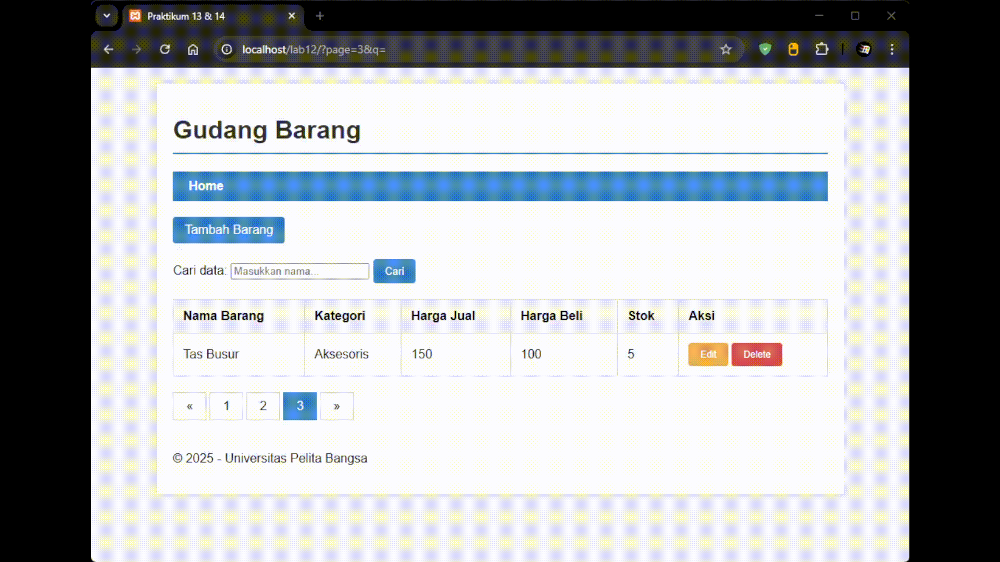
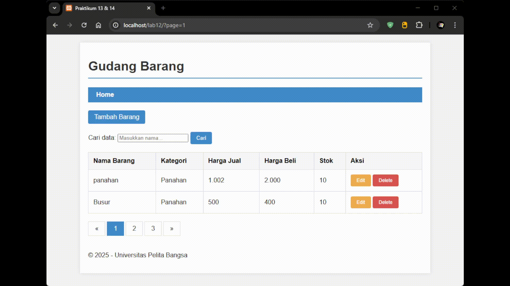

# Lab12Web

- Nama : Roufan Awaluna Romadhon
- NIM : 31240423
- Kelas : TI.24.A.3

---

## Deskripsi

Tugas ini Menggabungkan Praktikum 13 dan Praktikum 14 dimana kita harus Membuat Pagination dan Membuat Pencarian Data. Disini saya membuat web baru untuk praktek tersebut saja.

## Membuat Web

1. Pertama kita buat database.

```sql
CREATE DATABASE test1;
USE test1;

CREATE TABLE data_barang (
    id_barang INT AUTO_INCREMENT PRIMARY KEY,
    nama VARCHAR(100),
    kategori VARCHAR(50),
    harga_jual DECIMAL(10,2),
    harga_beli DECIMAL(10,2),
    stok INT
);

-- Data contoh untuk testing pagination
INSERT INTO data_barang (nama, kategori, harga_jual, harga_beli, stok) VALUES
('Panahan A', 'Panahan', 1000.00, 800.00, 10),
('Busur B', 'Panahan', 500.00, 400.00, 5),
('Anak Panah', 'Aksesoris', 50.00, 30.00, 100),
('Target Board', 'Aksesoris', 300.00, 250.00, 15),
('Tas Busur', 'Aksesoris', 150.00, 120.00, 8),
('Finger Tab', 'Aksesoris', 25.00, 20.00, 50);
```

2. Buat file koneksi.php

```php
<?php
$host = "localhost";
$user = "root";
$pass = "";
$db   = "test1";

// GUNAKAN mysqli_connect, BUKAN mysqli_query
$conn = mysqli_connect($host, $user, $pass, $db);

if (!$conn) {
    die("Koneksi gagal: " . mysqli_connect_error());
}
?>
```

3. Buat file index.php 

```php
<?php
include_once 'koneksi.php';

// Logika Pencarian
$q = "";
$sql_where = "";
if (isset($_GET['submit']) && !empty($_GET['q'])) {
    $q = $_GET['q'];
    $sql_where = " WHERE nama LIKE '{$q}%'";
}

// Logika Pagination
$sql_count = "SELECT COUNT(*) FROM data_barang" . $sql_where;
$result_count = mysqli_query($conn, $sql_count);
$r_data = mysqli_fetch_row($result_count);
$count = $r_data[0];

$per_page = 2; // Data per halaman
$num_page = ceil($count / $per_page);
$page = (isset($_GET['page'])) ? $_GET['page'] : 1;
$offset = ($page - 1) * $per_page;

// Query Utama
$sql = "SELECT * FROM data_barang" . $sql_where . " LIMIT {$offset}, {$per_page}";
$result = mysqli_query($conn, $sql);

include_once 'header.php';
?>

<div class="main">
    <a href="#" class="btn btn-primary">Tambah Barang</a>

    <form action="" method="get" style="margin: 20px 0;">
        <label for="q">Cari data: </label>
        <input type="text" id="q" name="q" value="<?php echo $q; ?>" placeholder="Masukkan nama...">
        <input type="submit" name="submit" value="Cari" class="btn btn-primary">
    </form>

    <?php if ($result): ?>
    <table>
        <thead>
            <tr>
                <th>Nama Barang</th>
                <th>Kategori</th>
                <th>Harga Jual</th>
                <th>Harga Beli</th>
                <th>Stok</th>
                <th>Aksi</th>
            </tr>
        </thead>
        <tbody>
            <?php while($row = mysqli_fetch_array($result)): ?>
            <tr>
                <td><?php echo $row['nama']; ?></td>
                <td><?php echo $row['kategori']; ?></td>
                <td><?php echo number_format($row['harga_jual'], 0, ',', '.'); ?></td>
                <td><?php echo number_format($row['harga_beli'], 0, ',', '.'); ?></td>
                <td><?php echo $row['stok']; ?></td>
                <td>
                    <a href="#" class="btn btn-edit">Edit</a>
                    <a href="#" class="btn btn-delete" onclick="return confirm('Hapus data?')">Delete</a>
                </td>
            </tr>
            <?php endwhile; ?>
        </tbody>
    </table>

    <ul class="pagination">
        <li><a href="?page=<?php echo ($page > 1) ? $page - 1 : 1; ?>&q=<?php echo $q; ?>">&laquo;</a></li>
        
        <?php for ($i=1; $i <= $num_page; $i++): ?>
            <?php 
                $link = "?page={$i}";
                if (!empty($q)) $link .= "&q={$q}";
                $class = ($page == $i ? 'active' : '');
            ?>
            <li><a class="<?php echo $class; ?>" href="<?php echo $link; ?>"><?php echo $i; ?></a></li>
        <?php endfor; ?>
        
        <li><a href="?page=<?php echo ($page < $num_page) ? $page + 1 : $num_page; ?>&q=<?php echo $q; ?>">&raquo;</a></li>
    </ul>
    <?php endif; ?>
</div>

<?php include_once 'footer.php'; ?>
```

4. Buat file header.php

```php
<!DOCTYPE html>
<html lang="id">
<head>
    <meta charset="UTF-8">
    <title>Praktikum 13 & 14</title>
    <link rel="stylesheet" href="style.css">
</head>
<body>
    <div class="container">
        <header>
            <h1>Gudang Barang</h1>
        </header>
        <nav>
            <a href="index.php" class="active">Home</a>
        </nav>
```

5. Buat file footer.php

```php
<footer>
            <p>&copy; 2025 - Universitas Pelita Bangsa</p>
        </footer>
    </div>
</body>
</html>
```

6. Menambahkan CSS

```css
body { font-family: Arial, sans-serif; background-color: #f4f4f4; margin: 0; padding: 0; }
.container { width: 80%; margin: 20px auto; background: #fff; padding: 20px; box-shadow: 0 0 10px rgba(0,0,0,0.1); }
header h1 { border-bottom: 2px solid #428bca; padding-bottom: 10px; color: #333; }
nav { background: #428bca; padding: 10px; margin-bottom: 20px; }
nav a { color: white; text-decoration: none; padding: 10px; font-weight: bold; }

table { width: 100%; border-collapse: collapse; margin-top: 20px; }
table th, table td { border: 1px solid #ddd; padding: 12px; text-align: left; }
table th { background-color: #f8f8f8; }

ul.pagination {
    display: inline-block;
    padding: 0;
    margin: 20px 0;
    list-style: none;
}
ul.pagination li {
    display: inline;
}
ul.pagination li a {
    color: black;
    float: left;
    padding: 8px 16px;
    text-decoration: none;
    transition: background-color .3s;
    border: 1px solid #ddd;
    margin-right: 4px;
}
ul.pagination li a.active {
    background-color: #428bca;
    color: white;
    border: 1px solid #428bca;
}
ul.pagination li a:hover:not(.active) {
    background-color: #ddd;
}

.btn { padding: 8px 15px; text-decoration: none; border-radius: 4px; display: inline-block; }
.btn-primary { background: #428bca; color: white; border: none; }
.btn-edit { background: #f0ad4e; color: white; font-size: 12px; }
.btn-delete { background: #d9534f; color: white; font-size: 12px; }
```

## Hasil (GIF)

1. Pagination



2. Pencarian Data

